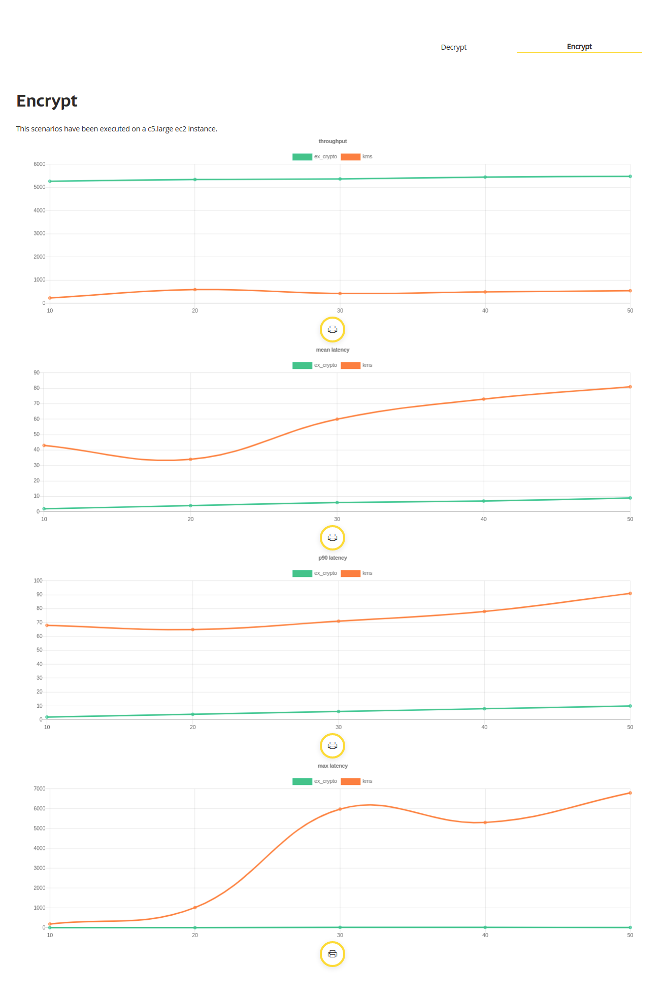
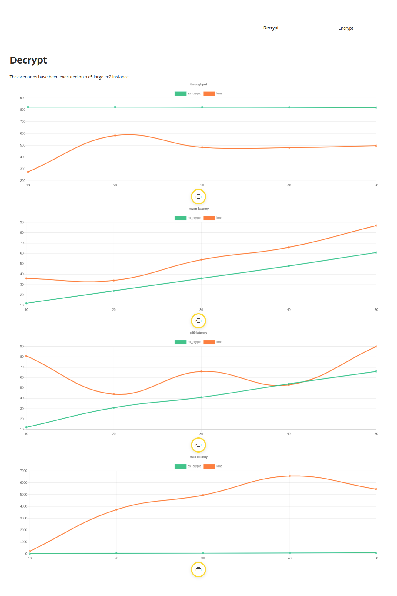

# MsBenchmarkEncryption

### Configuración de la prueba

- Pruebas realizada con: [Performance Analyzer](https://github.com/bancolombia/distributed-performance-analyzer).
```
execution: %{
 steps: 5,
 increment: 10,
 duration: 10000,
 constant_load: false
}
```

> El objetivo de este benchmark es realizar una comparación entre el uso de KMS (AWS Key Management Service) vs la implementación del cifrado y descifrado dentro de una instancia de EC2 (c5.large) con el lenguaje Elixir utilizando ex crypto en su versión 0.10.0

### Resultados



Nota: En los escenarios de prueba de KMS se obtiene un promedio de 5 peticiones fallidas con el siguiente mensaje:

`ThrottlingException: You have exceeded the rate at which you may call KMS. Reduce the frequency of your calls.`

## Installation

If [available in Hex](https://hex.pm/docs/publish), the package can be installed
by adding `ms_benchmark_encryption` to your list of dependencies in `mix.exs`:

```elixir
def deps do
  [
    {:ms_benchmark_encryption, "~> 0.1.0"}
  ]
end
```

Documentation can be generated with [ExDoc](https://github.com/elixir-lang/ex_doc)
and published on [HexDocs](https://hexdocs.pm). Once published, the docs can
be found at [https://hexdocs.pm/ms_benchmark_encryption](https://hexdocs.pm/ms_benchmark_encryption).

