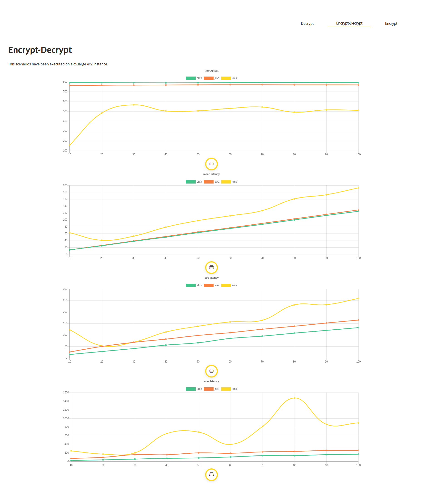
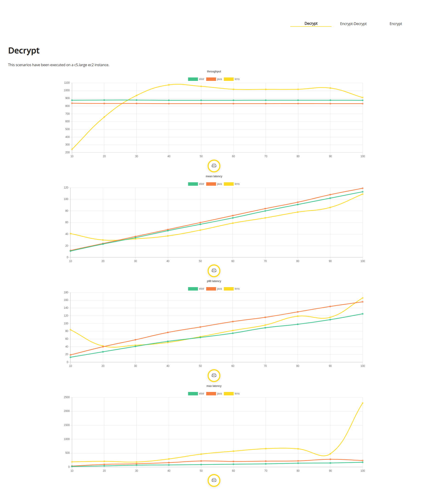
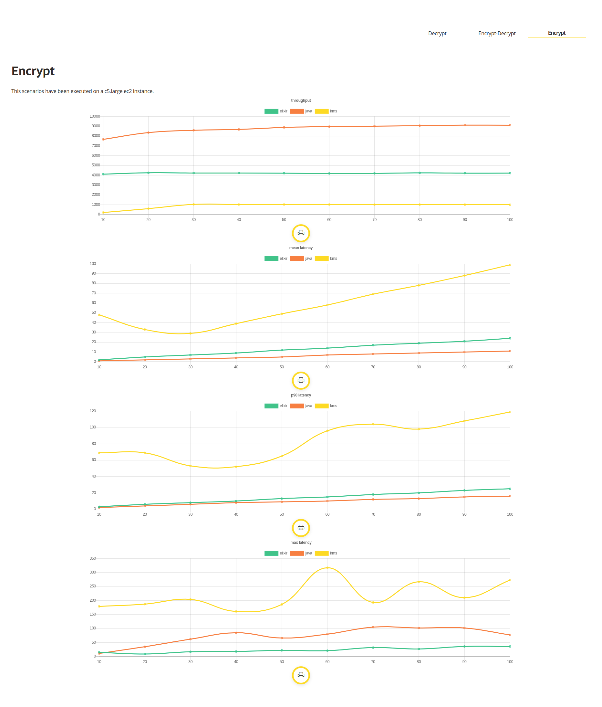

# MsBenchmarkEncryption

El objetivo de este benchmark es realizar una comparación entre el uso de KMS (AWS Key Management Service) vs la implementación de cifrado y descifrado dentro de una instancia de EC2 (c5.large) con el lenguaje Elixir y Java reactivo.

### Configuración de la prueba

- Pruebas realizada con: [Performance Analyzer](https://github.com/bancolombia/distributed-performance-analyzer).
```
execution: %{
 steps: 10,
 increment: 10,
 duration: 10000,
 constant_load: false
}
```

> El valor predeterminado de la cuota de AWS ([Cryptographic operations (RSA) request rate]) es de 500 por segundo (compartidas) para claves KMS de RSA. 

En los escenarios que se describen a continuación la cuota fue modificada a 1.000 transacciones por segundo. Si desea ver los resultados con los valores por defecto puede seguir el siguiente [link](results/kms-500/README.md)


### Resultados


Para los casos de uso de Kms así se cuente con multiples instancias haciendo uso del servicio, el limite esta dado por la cuota que se tenga en aws.
En otras palabras, si añadimos mas instancias podemos aumentar las transacciones por segundo para Elixir y Java, diferente que para Kms ya que estamos limitados por la cuota.





Nota: En los escenarios de alto uso de KMS es posible obtener mensajes de error con el siguiente mensaje:

`ThrottlingException: You have exceeded the rate at which you may call KMS. Reduce the frequency of your calls.`

#### Costo mensual aproximado - KMS

| Precio       |                                 |
|--------------|---------------------------------|
| 1 USD        | 1 clave de KMS                  |
| 3.000 USD    | 1.000 millones solicitudes (20.000 solicitudes dentro de la capa gratuita) x 0,03 USD / 10.000 solicitudes |

#### Costo mensual aproximado - EC2 c5.large

1 instancia x 0.085 USD x 730 horas en un mes = 62.05 USD (monthly onDemand cost)


[Cryptographic operations (RSA) request rate]: <https://docs.aws.amazon.com/es_es/kms/latest/developerguide/requests-per-second.html>
