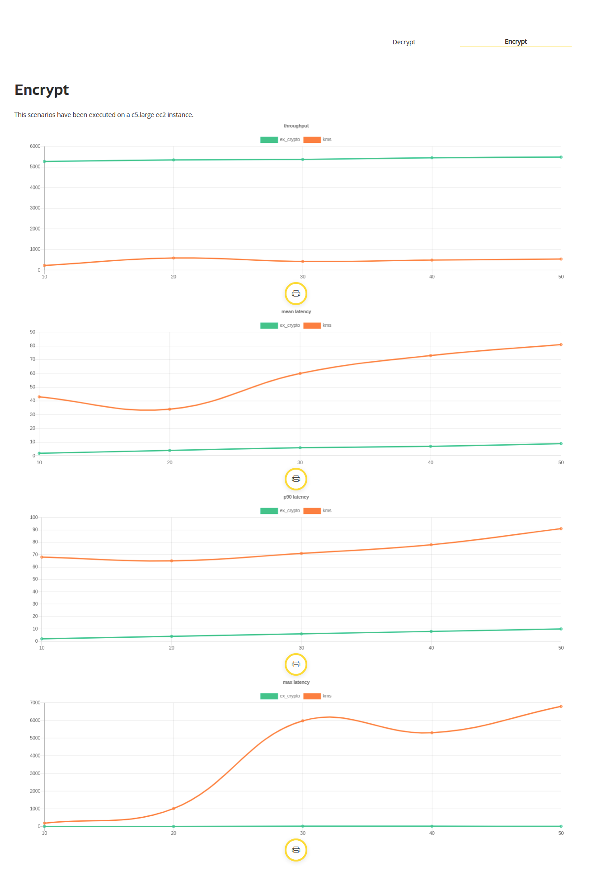
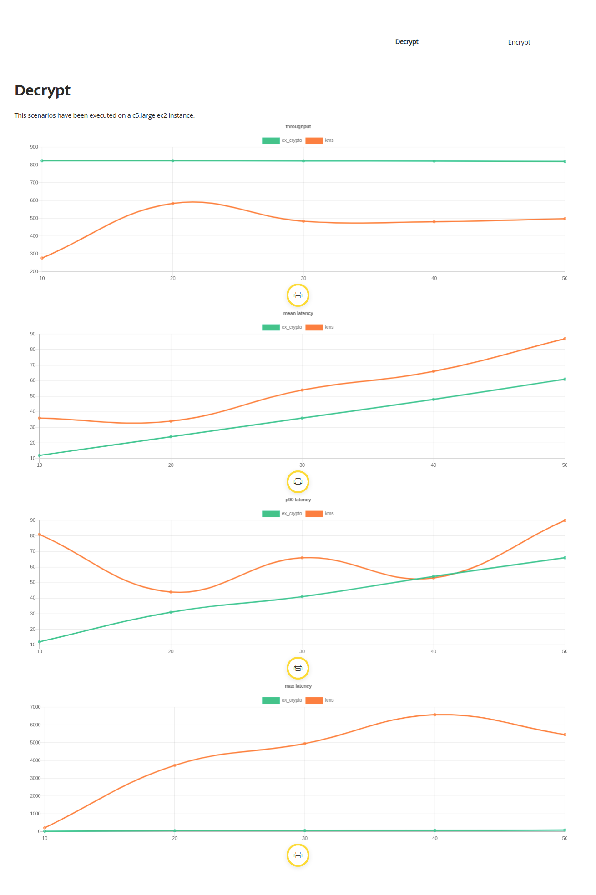

# MsBenchmarkEncryption

### Configuración de la prueba

- Pruebas realizada con: [Performance Analyzer](https://github.com/bancolombia/distributed-performance-analyzer).
```
execution: %{
 steps: 5,
 increment: 10,
 duration: 10000,
 constant_load: false
}
```

### Resultados

